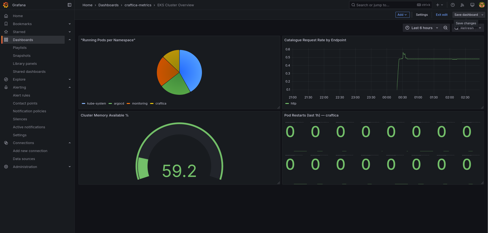
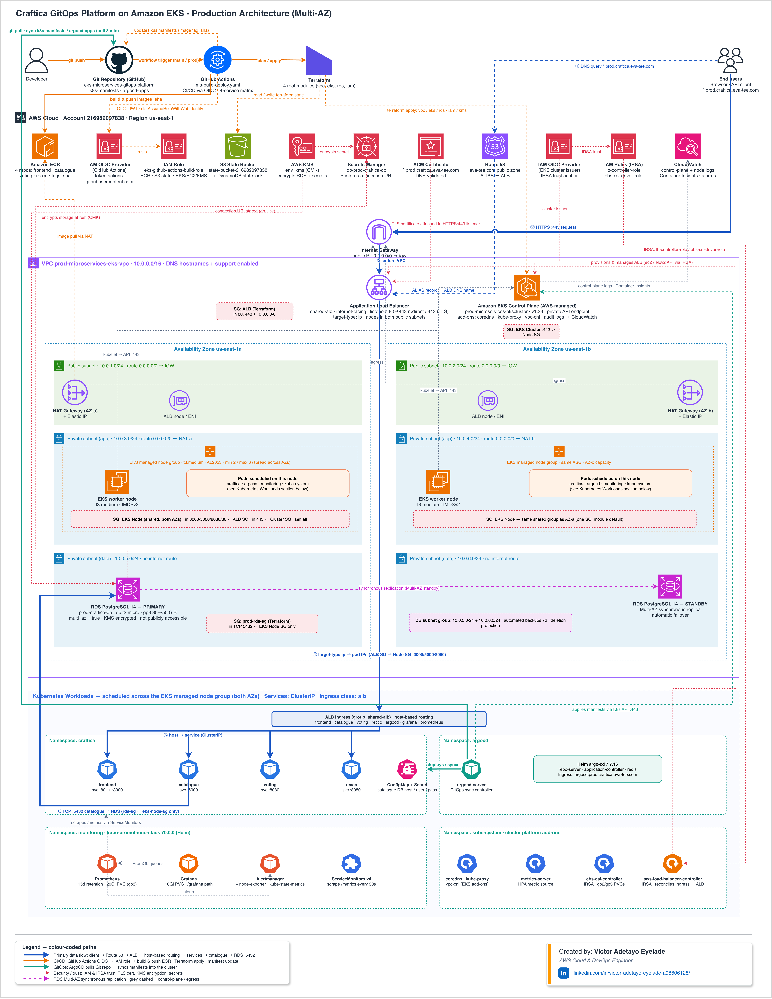
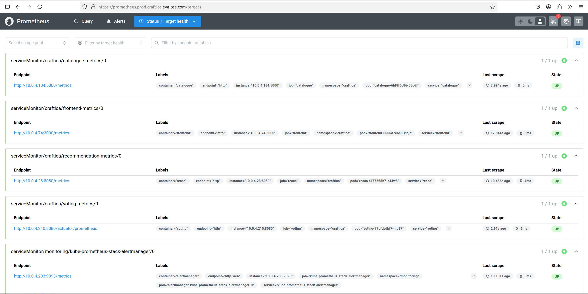
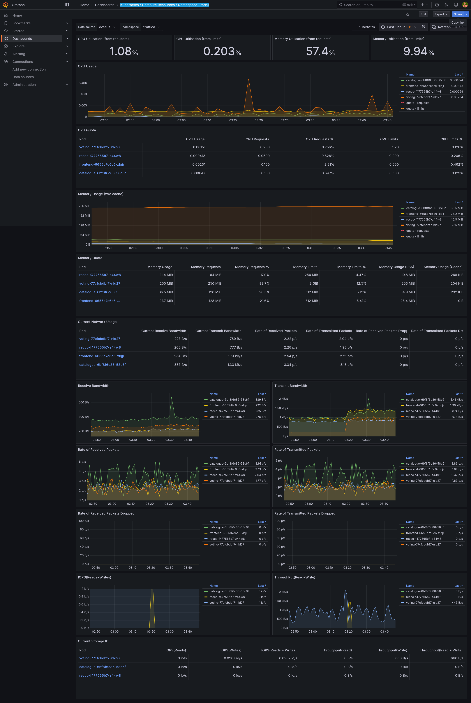
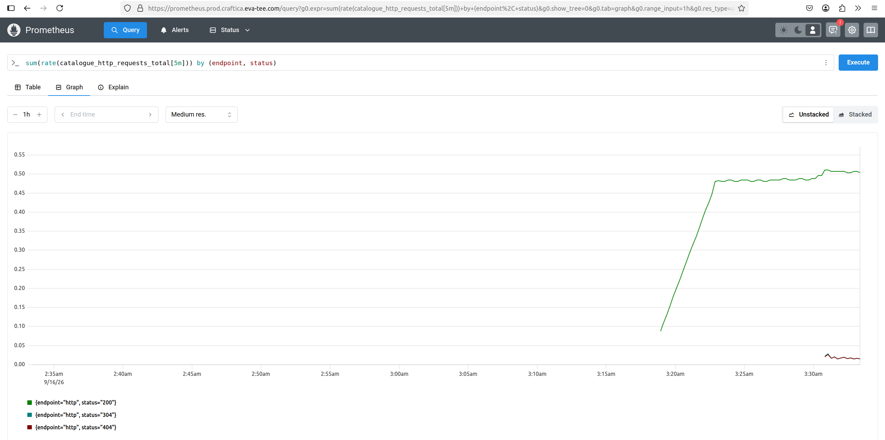
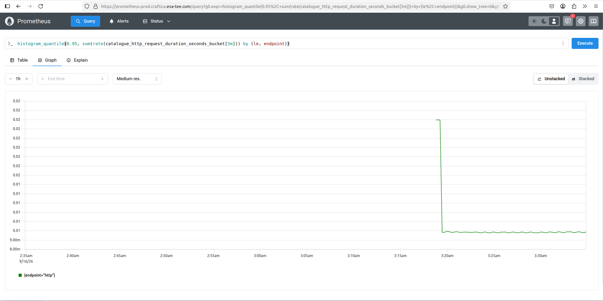

# EKS Observability Platform

[](https://kubernetes.io/)
[](https://prometheus.io/)
[](https://grafana.com/)
[](https://www.terraform.io/)
[](https://helm.sh/)
[](https://aws.amazon.com/eks/)


This project provisions a production-style monitoring and observability stack on Amazon EKS using **Terraform and Helm charts**. Terraform manages the Helm releases that deploy and configure Prometheus, Grafana, Alertmanager, metrics-server, node-exporter, and kube-state-metrics inside the EKS cluster.

The platform extends the [EKS Microservices GitOps Platform](https://github.com/Evatee-coder/eks-microservices-gitops-platform) and addresses the operational gap between successfully deploying applications and understanding their health, latency, errors, dependencies, and resource consumption in a live Kubernetes environment.

Prometheus uses Prometheus Operator `ServiceMonitor` resources to discover application metrics endpoints through Kubernetes labels. Grafana provides cluster-level and application-level dashboards covering workload health, resource utilization, request rates, HTTP errors, P95 latency, service dependencies, database connectivity, and application runtime behavior.

Prometheus and Grafana use Amazon EBS-backed persistent volumes, while the AWS Load Balancer Controller provides HTTPS access through Application Load Balancer ingress. Alertmanager is installed as part of the monitoring stack, but automated application alert rules and external notification routing are reserved for the next phase of the project.

The observability stack is maintained separately from the application and cluster infrastructure repositories. This separation allows monitoring configuration, dashboards, scrape targets, retention policies, and resource settings to evolve without coupling observability changes to application releases.



*Figure 1. Custom Grafana dashboard combining application traffic, request latency, service health, and Kubernetes workload telemetry.*

## Table of Contents

- [Overview](#overview)
- [What This Project Demonstrates](#what-this-project-demonstrates)
- [Architecture](#architecture)
- [Monitored Workloads](#monitored-workloads)
- [Tech Stack](#tech-stack)
- [Key Engineering Decisions](#key-engineering-decisions)
- [Repository Responsibilities](#repository-responsibilities)
- [Dashboards and PromQL Queries](#dashboards-and-promql-queries)
- [Alerting Status](#alerting-status)
- [Prerequisites](#prerequisites)
- [Setup and Usage](#setup-and-usage)
- [Verification](#verification)
- [Challenges and Fixes](#challenges-and-fixes)
- [Security Considerations](#security-considerations)
- [Troubleshooting](#troubleshooting)
- [Future Improvements](#future-improvements)
- [Related Project](#related-project)
- [Author](#author)


## Overview
This repository contains the Terraform configuration used to deploy and manage a production-style monitoring and observability stack on an existing Amazon EKS cluster.

The platform uses **Terraform and Helm charts** to automate the deployment of its monitoring components. Terraform manages the Helm releases that install and configure `kube-prometheus-stack` and `metrics-server` inside the cluster.

The `kube-prometheus-stack` deploys:

- Prometheus
- Grafana
- Alertmanager
- Prometheus Operator
- node-exporter
- kube-state-metrics

Terraform also manages the supporting Kubernetes resources and monitoring configuration, including:

- The dedicated `monitoring` namespace
- Helm release values and version configuration
- Application-specific `ServiceMonitor` resources
- Grafana and Prometheus ingress resources
- Persistent-volume configuration
- CPU and memory requests and limits
- Prometheus retention and storage limits

Prometheus collects infrastructure telemetry from the EKS cluster and application-level metrics from four instrumented Craftista microservices:

| Service | Runtime | Metrics endpoint | Primary signals |
|---|---|---|---|
| Frontend | Node.js and Express | `/metrics` | Request rate, latency, status codes, process metrics, and dependency health |
| Catalogue | Python and Flask | `/metrics` | Request rate, latency, database connectivity, and product count |
| Recommendation | Go and Gin | `/metrics` | Request rate, latency, and recommendations served |
| Voting | Java and Spring Boot | `/actuator/prometheus` | HTTP performance, JVM memory, garbage collection, threads, CPU, and database connection-pool metrics |

The Prometheus Operator uses `ServiceMonitor` resources to discover each application's metrics endpoint through Kubernetes labels. This removes the need to maintain static scrape targets and provides a Kubernetes-native approach for onboarding monitored services.

Grafana uses Prometheus as its primary data source and provides visibility into:

- EKS cluster and node health
- Pod and workload resource consumption
- Application request volume
- HTTP error rates
- P95 request latency
- Service dependency availability
- Database connection status
- JVM and Node.js runtime behavior

Prometheus and Grafana use persistent volumes backed by Amazon EBS so that metrics and dashboard state can survive pod restarts. The AWS Load Balancer Controller provides HTTPS access to the monitoring interfaces through Application Load Balancer ingress, with TLS certificates managed through AWS Certificate Manager and DNS resolution provided by Amazon Route 53.

Alertmanager is installed as part of the `kube-prometheus-stack`; however, automated application alert rules and external notification routing have not yet been fully implemented. Initial alert conditions were explored manually, while version-controlled `PrometheusRule` resources and Alertmanager receiver configuration are reserved for the next project phase.

The observability stack is maintained separately from the application and EKS infrastructure repositories. This separation allows monitoring configuration, dashboards, scrape targets, retention policies, and resource settings to evolve independently from application releases and cluster-provisioning changes.

By managing the monitoring setup with Terraform and Helm charts, the platform remains repeatable, version-controlled, and reviewable. Infrastructure changes can be inspected through `terraform plan` and deployed consistently through `terraform apply`, reducing configuration drift and eliminating the need for manual installation through the Kubernetes cluster.

## What This Project Demonstrates

- Automated deployment of a Kubernetes monitoring stack on Amazon EKS using **Terraform and Helm charts**
- Terraform-managed Helm releases for Prometheus, Grafana, Alertmanager, metrics-server, node-exporter, and kube-state-metrics
- End-to-end metrics collection across the EKS cluster and four polyglot microservices
- Application instrumentation for services written in Node.js, Python, Go, and Java
- Kubernetes-native metrics discovery using Prometheus Operator `ServiceMonitor` resources
- Infrastructure visibility covering cluster, node, pod, deployment, and workload health
- Application-level visibility covering request rates, HTTP errors, P95 latency, dependency health, database connectivity, and runtime behavior
- PromQL queries for investigating application performance and validating dashboard metrics
- Custom Grafana dashboards for correlating infrastructure health with application behavior
- Persistent Prometheus and Grafana storage using Amazon EBS and the EBS CSI driver
- HTTPS access to the monitoring interfaces through AWS Load Balancer Controller-managed ALB ingress
- Separation of observability, application delivery, and cluster infrastructure into independently managed repositories
- Explicit CPU, memory, storage, and Prometheus retention settings for predictable resource consumption
- A foundation for the next project phase: version-controlled Prometheus alert rules and automated Alertmanager notification routing


## Architecture

The observability stack is deployed on an existing Amazon EKS cluster using Terraform-managed Helm releases. Terraform provides the infrastructure automation layer, while Helm installs and configures the `kube-prometheus-stack` and `metrics-server` inside the cluster.

The `kube-prometheus-stack` deploys Prometheus, Grafana, Alertmanager, Prometheus Operator, node-exporter, and kube-state-metrics. Terraform also manages the monitoring namespace, application-specific `ServiceMonitor` resources, ingress resources, persistent storage configuration, resource requests and limits, and Prometheus alert rules.



*Figure 2. Architecture of the Amazon EKS observability platform provisioned with Terraform and Helm. Prometheus collects Kubernetes infrastructure and application metrics, Grafana provides visualization, Alertmanager handles alert routing, and Amazon EBS provides persistent storage.*

Prometheus collects infrastructure telemetry from node-exporter and kube-state-metrics while using Prometheus Operator `ServiceMonitor` resources to discover the metrics endpoints exposed by the frontend, catalogue, recommendation, and voting services.

Grafana uses Prometheus as its primary data source to visualize cluster health, workload resource consumption, request rates, error rates, P95 latency, dependency availability, database connectivity, and application runtime behavior. Prometheus evaluates infrastructure and application alert rules and forwards active alerts to Alertmanager for routing.

The observability stack remains separate from the application and cluster infrastructure repositories. This separation allows monitoring configuration, dashboards, alert rules, scrape targets, and retention policies to be versioned and changed without coupling observability releases to application deployments.



*Figure 3. Prometheus target-discovery view confirming that the instrumented microservices and Kubernetes monitoring components are being scraped successfully.*

## Monitored Workloads

| Service | Runtime | Metrics endpoint | Signals |
|---|---|---|---|
| Frontend | Node.js / Express | `/metrics` on `3000` | Request rate, latency, status codes, dependency health, and process metrics |
| Catalogue | Python / Flask | `/metrics` on `5000` | Request rate, latency, database status, and product count |
| Recommendation | Go / Gin | `/metrics` on `8080` | Request rate, latency, and recommendations served |
| Voting | Java / Spring Boot | `/actuator/prometheus` on `8080` | HTTP, JVM, garbage collection, threads, CPU, and HikariCP connection-pool metrics |

## Tech Stack

| Category | Technology | Implementation |
|---|---|---|
| Cloud platform | Amazon EKS | Hosts the Kubernetes workloads and observability stack |
| Infrastructure as Code | Terraform | Manages Helm releases, Kubernetes resources, ingress, storage, and monitoring configuration |
| Package management | Helm | Installs `kube-prometheus-stack` and `metrics-server` on the EKS cluster |
| Metrics collection | Prometheus | Scrapes and stores Kubernetes and application metrics |
| Visualization | Grafana | Displays cluster, workload, and microservice dashboards |
| Alerting | Alertmanager and PrometheusRule | Evaluates and routes infrastructure and application alerts |
| Service discovery | Prometheus Operator and ServiceMonitor | Discovers application metrics endpoints through Kubernetes labels |
| Cluster telemetry | node-exporter and kube-state-metrics | Exposes node, Kubernetes object, pod, and workload metrics |
| Resource metrics | metrics-server | Supports `kubectl top` and Horizontal Pod Autoscaling |
| Persistent storage | Amazon EBS and EBS CSI driver | Retains Prometheus data and Grafana configuration |
| External access | AWS Load Balancer Controller and ALB | Exposes Grafana and Prometheus through HTTPS ingress |
| Security and DNS | ACM, IAM, IRSA, and Route 53 | Provides TLS, AWS permissions, and DNS resolution |
| Query language | PromQL | Supports dashboards, troubleshooting, and alert expressions |

## Key Engineering Decisions

- **Separated observability from workload delivery.** The monitoring stack lives in its own repository and Terraform state. This reduces the blast radius of changes and allows platform telemetry to evolve independently of the GitOps application lifecycle.

- **Used `ServiceMonitor` resources instead of static scrape configuration.** Prometheus discovers services through Kubernetes labels, so adding a monitored workload does not require editing a central list of endpoints.

- **Instrumented each service at the application layer.** Cluster health alone cannot explain user-facing behavior. HTTP latency, error counts, dependency state, JVM health, and database-pool metrics provide the signals needed to diagnose failures across the request path.

- **Kept cluster-coupled dependencies with the cluster stack.** The EBS CSI driver remains in the infrastructure repository because it depends on the EKS OIDC provider and IRSA. This avoids a circular dependency while allowing Prometheus and Grafana to request persistent volumes.

- **Applied bounded retention and resource limits.** Prometheus is configured for 15 days or 10 GB of retention with explicit CPU and memory requests and limits. This balances diagnostic depth with predictable portfolio-environment costs.

## Repository Responsibilities

| Component | Namespace | Provisioning method | Purpose |
|---|---|---|---|
| `kube-prometheus-stack` | `monitoring` | Helm through Terraform | Prometheus, Grafana, Alertmanager, exporters, and recording and alert rules |
| `metrics-server` | `kube-system` | Helm through Terraform | Resource Metrics API for `kubectl top` and Horizontal Pod Autoscaling |
| ServiceMonitors | Application namespace | Terraform-managed manifests | Discover the four microservice metrics endpoints |
| Grafana and Prometheus ingress | `monitoring` | Terraform-managed manifests | ALB-backed HTTPS access |
| EBS CSI driver | `kube-system` | Companion infrastructure repository | Dynamic persistent volumes for Prometheus and Grafana |

## Dashboards and Queries

The dashboards combine infrastructure health with service-level signals so an operator can move from a cluster symptom to an affected workload and then to the relevant application metric.


*Figure 4. Grafana cluster dashboard displaying node, pod, CPU, memory, and Kubernetes workload health across the Amazon EKS environment.*

PromQL is used to validate raw metric series before they are promoted into dashboard panels or alerts.


*Figure 5. PromQL validation in Prometheus used to inspect application metrics before promoting the query into a Grafana panel or alert rule.*

### Example P95 latency query

```promql
histogram_quantile(
  0.95,
  sum by (le, service) (
    rate(http_request_duration_seconds_bucket[5m])
  )
)
```


*Figure 6. P95 request-latency analysis calculated from Prometheus histogram buckets over a five-minute observation window.*

## Alerting Status

Alertmanager is deployed as part of the `kube-prometheus-stack`; however, automated application-level alerting and external notification routing are not yet fully implemented.

During the initial implementation, alert conditions were explored and tested manually. These tests helped identify the application signals that should become formal Prometheus alert rules, including:

- Elevated HTTP 5xx error rates
- Sustained P95 request latency
- Unavailable database connections
- Unhealthy downstream dependencies
- High JVM heap utilization
- Unavailable Prometheus scrape targets

The next phase will manage these conditions through version-controlled `PrometheusRule` resources and configure Alertmanager receivers for an approved notification channel.

Planned validation will cover the complete alert lifecycle:

1. Introduce a controlled application failure.
2. Confirm that the corresponding metric changes.
3. Verify that the Prometheus alert enters the pending state.
4. Confirm that the alert transitions to the firing state.
5. Verify that Alertmanager receives and routes the alert.
6. Restore the service and confirm that the alert resolves.

Until this workflow is automated and tested end to end, alerting is treated as a planned capability rather than a completed production feature.

## Prerequisites

Before deploying the monitoring stack, ensure the following components are available:

- AWS CLI authenticated to the target AWS account
- Terraform `>= 1.5`
- `kubectl`
- Helm
- An existing Amazon EKS cluster
- AWS Load Balancer Controller installed in the cluster
- EBS CSI driver configured with IRSA
- A Route 53 hosted zone
- An ACM certificate for HTTPS ingress
- The Craftista microservices deployed to the target cluster

The EKS platform and microservices are provided by the companion project:

[eks-microservices-gitops-platform](https://github.com/Evatee-coder/eks-microservices-gitops-platform)

## Setup and Usage

### 1. Clone the repository

```bash
git clone https://github.com/Evatee-coder/eks-observability-platform.git
cd eks-observability-platform
```

### 2. Confirm AWS access

```bash
aws sts get-caller-identity
```

### 3. Configure access to the EKS cluster

```bash
aws eks update-kubeconfig \
  --region <aws-region> \
  --name <eks-cluster-name>
```

Confirm that the Kubernetes API is reachable:

```bash
kubectl get nodes
```

### 4. Initialize Terraform

```bash
terraform init
```

### 5. Check Terraform formatting

```bash
terraform fmt -check -recursive
```

To automatically format the Terraform files, run:

```bash
terraform fmt -recursive
```

### 6. Validate the configuration

```bash
terraform validate
```

### 7. Create the Terraform plan

```bash
terraform plan \
  -var="environment=<environment>" \
  -var="app_name=<application-name>" \
  -var="domain=<domain-name>" \
  -var="acm_certificate_arn=<certificate-arn>" \
  -out=tfplan
```

Example:

```bash
terraform plan \
  -var="environment=dev" \
  -var="app_name=craftista" \
  -var="domain=example.com" \
  -var="acm_certificate_arn=arn:aws:acm:us-east-1:123456789012:certificate/example" \
  -out=tfplan
```

### 8. Deploy the observability stack

```bash
terraform apply tfplan
```

### 9. Verify the monitoring namespace

```bash
kubectl get namespace monitoring
```

### 10. Verify the monitoring workloads

```bash
kubectl get pods -n monitoring
```

Expected components include:

- Prometheus
- Grafana
- Alertmanager
- `kube-state-metrics`
- `node-exporter`
- Prometheus Operator

### 11. Verify the ServiceMonitors

```bash
kubectl get servicemonitors -A
```

### 12. Verify the Prometheus rules

```bash
kubectl get prometheusrules -A
```

### 13. Verify the Metrics API

```bash
kubectl top nodes
kubectl top pods -A
```

### 14. Verify persistent storage

```bash
kubectl get pvc -n monitoring
kubectl get pv
```

### 15. Verify ingress resources

```bash
kubectl get ingress -n monitoring
```

Confirm that all four application endpoints report `UP` in:

```text
Prometheus > Status > Targets
```

## Local Access

If ingress is not yet configured, use port forwarding to access Prometheus and Grafana.

### Access Prometheus

```bash
kubectl port-forward \
  -n monitoring \
  svc/kube-prometheus-stack-prometheus \
  9090:9090
```

Open:

```text
http://localhost:9090
```

### Access Grafana

```bash
kubectl port-forward \
  -n monitoring \
  svc/kube-prometheus-stack-grafana \
  3000:80
```

Open:

```text
http://localhost:3000
```

Change the initial Grafana administrator password before exposing Grafana through an external ingress.

## Useful PromQL Queries

### Catalogue request rate

```promql
sum(
  rate(catalogue_http_requests_total[5m])
)
```

### Frontend request rate

```promql
sum(
  rate(frontend_http_requests_total[5m])
)
```

### Recommendation request rate

```promql
sum(
  rate(recommendation_http_requests_total[5m])
)
```

### Voting service request rate

```promql
sum(
  rate(
    http_server_requests_seconds_count{
      application="voting-service"
    }[5m]
  )
)
```

### Catalogue P95 latency

```promql
histogram_quantile(
  0.95,
  sum by (le) (
    rate(catalogue_http_request_duration_seconds_bucket[5m])
  )
)
```

### Frontend P95 latency

```promql
histogram_quantile(
  0.95,
  sum by (le) (
    rate(frontend_http_request_duration_seconds_bucket[5m])
  )
)
```

### Recommendation P95 latency

```promql
histogram_quantile(
  0.95,
  sum by (le) (
    rate(recommendation_http_request_duration_seconds_bucket[5m])
  )
)
```

### Catalogue HTTP 5xx rate

```promql
sum(
  rate(
    catalogue_http_requests_total{
      status=~"5.."
    }[5m]
  )
)
```

### Frontend HTTP 5xx rate

```promql
sum(
  rate(
    frontend_http_requests_total{
      status_code=~"5.."
    }[5m]
  )
)
```

### Catalogue database status

```promql
catalogue_db_connection_status
```

A value of `1` indicates a healthy connection. A value of `0` indicates that the database connection is unavailable.

### Frontend dependency health

```promql
frontend_service_dependency_up
```

### Voting service JVM heap utilization

```promql
sum(
  jvm_memory_used_bytes{
    application="voting-service",
    area="heap"
  }
)
/
sum(
  jvm_memory_max_bytes{
    application="voting-service",
    area="heap"
  }
)
```

## Challenges and Fixes

### ServiceMonitor resources raced the Prometheus Operator CRDs

**Issue:** Terraform could attempt to create `ServiceMonitor` objects before the Helm release had installed and established the required custom resource definitions.

**Fix:** Added an explicit dependency from the custom resources to the `kube-prometheus-stack` Helm release. This preserves deterministic ordering and prevents intermittent first-apply failures.

### Application targets were not automatically discoverable

**Issue:** The four services use different ports, labels, and metrics paths, including Spring Boot's `/actuator/prometheus` endpoint. A single generic scrape definition could not correctly address every workload.

**Fix:** Created one label-driven `ServiceMonitor` per service with the correct named port and path. Target health was then verified in the Prometheus UI before the dashboards were built.

### EKS resource metrics failed certificate validation

**Issue:** `metrics-server` could not collect kubelet metrics reliably when nodes were addressed by internal IP and kubelet serving certificates did not match a verifiable hostname.

**Fix:** Configured the following arguments:

```text
--kubelet-preferred-address-types=InternalIP
--kubelet-insecure-tls
```

The Metrics API was then validated with:

```bash
kubectl top nodes
kubectl top pods -A
```

## Security and Operational Considerations

- Store Grafana credentials and Alertmanager receiver secrets in Kubernetes Secrets, AWS Secrets Manager, or AWS Systems Manager Parameter Store.
- Do not commit credentials or webhook URLs to Terraform variable files.
- Restrict, authenticate, or remove public Prometheus ingress outside a controlled portfolio environment.
- Avoid high-cardinality metric labels such as request IDs and user IDs.
- Size scrape intervals, retention, and persistent volumes against workload cardinality and recovery requirements.
- Change the initial Grafana administrator credential before exposing Grafana.
- Use HTTPS for externally accessible monitoring interfaces.
- Apply least-privilege IAM permissions to the EBS CSI driver and other AWS-integrated controllers.

## Troubleshooting

### A Prometheus target is missing or down

List the ServiceMonitors:

```bash
kubectl get servicemonitors -A
```

Inspect the affected ServiceMonitor:

```bash
kubectl describe servicemonitor <name> -n <namespace>
```

Check the application Service labels:

```bash
kubectl get svc -n <namespace> --show-labels
```

Confirm that:

- The ServiceMonitor selector matches the Service labels
- The named Service port exists
- The metrics path is correct
- The application responds on the configured port
- Prometheus can access the application namespace

### Grafana panels show no data

Verify the Prometheus data source in Grafana.

Run the panel's PromQL query directly in Prometheus and confirm that the selected dashboard time range overlaps the available samples.

Check Grafana logs:

```bash
kubectl logs \
  -n monitoring \
  deployment/kube-prometheus-stack-grafana
```

### PersistentVolumeClaims remain pending

Check the monitoring PVCs:

```bash
kubectl get pvc -n monitoring
```

Check the available storage classes:

```bash
kubectl get storageclass
```

Check the EBS CSI driver:

```bash
kubectl get pods \
  -n kube-system \
  -l app.kubernetes.io/name=aws-ebs-csi-driver
```

Confirm that:

- The EBS CSI driver is running
- The configured storage class exists
- The CSI driver has the required IAM permissions
- The volume can be provisioned in the target Availability Zone

### `kubectl top` returns no metrics

Check the `metrics-server` pods:

```bash
kubectl get pods \
  -n kube-system \
  -l app.kubernetes.io/name=metrics-server
```

Review the logs:

```bash
kubectl logs \
  -n kube-system \
  deployment/metrics-server
```

Check the Metrics API:

```bash
kubectl get apiservice v1beta1.metrics.k8s.io
```

## Future Improvements

### Alerting and Incident Response

- Define application alert conditions as version-controlled `PrometheusRule` resources
- Configure Alertmanager routing and external notification receivers
- Store receiver credentials in Kubernetes Secrets or AWS Secrets Manager rather than Terraform state
- Validate the complete pending, firing, notification, recovery, and resolved alert lifecycle
- Document alert severity, ownership, response expectations, and runbook links
- Add service-level objectives and multi-window burn-rate alerts for availability and latency

### Logs and Distributed Tracing

- Add Loki and Promtail for centralized log aggregation and metrics-to-logs correlation
- Add OpenTelemetry instrumentation and Tempo for distributed tracing across the microservices
- Correlate metrics, logs, and traces through shared service and environment labels

### Infrastructure Automation and Security

- Add GitHub Actions workflows for Terraform formatting, validation, planning, and controlled deployment
- Add Checkov and Trivy scanning for Terraform, Kubernetes, and container security issues
- Validate Prometheus rules and Grafana configuration in CI before deployment
- Restrict monitoring interfaces through private ingress, identity-aware authentication, or VPN connectivity

### Configuration and Scalability

- Package custom Grafana dashboards as version-controlled Kubernetes resources
- Replace the portfolio-scale `gp2` configuration with environment-specific storage classes
- Size Prometheus retention and persistent storage according to metric cardinality and environment requirements
- Add environment-specific resource requests and limits for the monitoring components

## Screenshot Structure

```text
docs/
└── images/
    ├── alertmanager-rules.png
    ├── grafana-cluster-dashboard.png
    ├── grafana-custom-dashboard.png
    ├── prometheus-latency-p95.png
    ├── prometheus-promql-query.png
    └── prometheus-targets.png
```

## Related Project

This repository is the observability continuation of:

[eks-microservices-gitops-platform](https://github.com/Evatee-coder/eks-microservices-gitops-platform)

The companion project provides:

- Amazon EKS infrastructure
- Container build and delivery workflows
- Amazon ECR repositories
- Argo CD-based GitOps delivery
- Kubernetes workload configuration
- Four-service Craftista application
- Application Load Balancer routing
- Amazon RDS connectivity

This repository adds the monitoring, visualization, alerting, and operational-diagnostics layer required to operate that platform effectively.

## Author

**Victor Adetayo Eyelade**

- GitHub: [Evatee-coder](https://github.com/Evatee-coder)
- LinkedIn: [Victor Adetayo Eyelade](https://www.linkedin.com/in/victor-adetayo-eyelade-a98606128/)