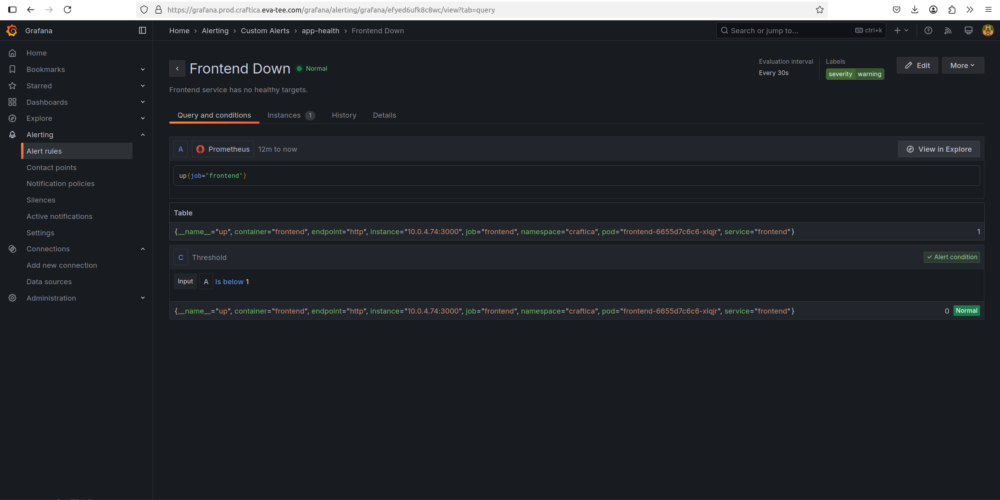

# EKS Observability Platform

[](https://kubernetes.io/)
[](https://prometheus.io/)
[](https://grafana.com/)
[](https://www.terraform.io/)
[](https://aws.amazon.com/eks/)

This project provides a production-style observability layer for a multi-service application running on Amazon EKS. It uses Prometheus, Grafana, Alertmanager, and Kubernetes-native service discovery to expose cluster health, application performance, dependency status, and actionable alerts.

The platform extends the [EKS Microservices GitOps Platform](https://github.com/Evatee-coder/eks-microservices-gitops-platform) and reflects a real-world operating model in which application delivery and observability are managed as separate platform capabilities.


*Figure 1. Custom Grafana dashboard providing a consolidated view of application traffic, service performance, and Kubernetes workload health.*

## Overview

Deploying an application successfully does not establish that it is healthy, responsive, or reliable. This project closes that operational gap by adding metrics collection, visualization, alerting, and diagnostic capabilities to the Craftista microservices platform running on Amazon EKS.

The observability platform monitors four services implemented with Node.js, Python, Go, and Java. Each service exposes Prometheus-compatible application metrics, including request volume, error rates, latency distributions, dependency health, database connectivity, and runtime behavior.

At the infrastructure layer, the platform collects Kubernetes control-plane, node, pod, and workload metrics using the `kube-prometheus-stack`, `node-exporter`, `kube-state-metrics`, and `metrics-server`. Grafana presents these signals through cluster and application dashboards, while Alertmanager provides the foundation for routing operational alerts.

The monitoring stack is maintained independently from the application and cluster infrastructure. This separation reduces deployment coupling, limits the blast radius of changes, and allows observability components to evolve without requiring application releases.


## Table of Contents

- [Overview](#overview)
- [What This Project Demonstrates](#what-this-project-demonstrates)
- [Architecture](#architecture)
- [Monitored Workloads](#monitored-workloads)
- [Tech Stack](#tech-stack)
- [Key Engineering Decisions](#key-engineering-decisions)
- [Repository Responsibilities](#repository-responsibilities)
- [Dashboards and PromQL Queries](#dashboards-and-promql-queries)
- [Alerting](#alerting)
- [Prerequisites](#prerequisites)
- [Setup and Usage](#setup-and-usage)
- [Verification](#verification)
- [Challenges and Fixes](#challenges-and-fixes)
- [Security Considerations](#security-considerations)
- [Troubleshooting](#troubleshooting)
- [Future Improvements](#future-improvements)
- [Related Project](#related-project)
- [Author](#author)

## What This Project Demonstrates

- End-to-end metrics collection for an Amazon EKS cluster and four polyglot microservices
- Automatic scrape-target discovery with Prometheus Operator `ServiceMonitor` resources
- Cluster, workload, runtime, database, and application-level telemetry in Grafana
- PromQL-based request-rate, error-rate, and P95-latency analysis
- Kubernetes and application alert rules managed as code
- Persistent metrics and dashboard storage backed by Amazon EBS
- HTTPS access through AWS Load Balancer Controller-managed ALB ingress

## Architecture


Terraform owns the monitoring namespace, Helm releases, ingress resources, and per-service monitors. Prometheus scrapes both Kubernetes infrastructure exporters and application endpoints, Grafana queries Prometheus for dashboards, and Alertmanager evaluates routed alerts.

The monitoring stack remains separate from the application and cluster repositories so it can be versioned, changed, or reused without coupling observability releases to workload deployments.


*Figure 2. Prometheus target-discovery view confirming that the instrumented microservices and Kubernetes monitoring components are being scraped successfully.*

## Monitored Workloads

| Service | Runtime | Metrics endpoint | Signals |
|---|---|---|---|
| Frontend | Node.js / Express | `/metrics` on `3000` | Request rate, latency, status codes, dependency health, and process metrics |
| Catalogue | Python / Flask | `/metrics` on `5000` | Request rate, latency, database status, and product count |
| Recommendation | Go / Gin | `/metrics` on `8080` | Request rate, latency, and recommendations served |
| Voting | Java / Spring Boot | `/actuator/prometheus` on `8080` | HTTP, JVM, garbage collection, threads, CPU, and HikariCP connection-pool metrics |

## Tech Stack

| Category | Technologies | Role in the platform |
|---|---|---|
| Cloud platform | AWS, Amazon EKS, Amazon EBS | Runs the Kubernetes platform and provides persistent monitoring storage |
| Infrastructure as Code | Terraform | Provisions Helm releases, monitoring resources, ingress, and configuration |
| Container orchestration | Kubernetes, Helm | Runs workloads and manages monitoring components |
| Metrics collection | Prometheus, Prometheus Operator | Scrapes, stores, and queries infrastructure and application metrics |
| Service discovery | ServiceMonitor CRDs | Automatically discovers application metrics endpoints through Kubernetes labels |
| Visualization | Grafana | Presents cluster, workload, and application telemetry |
| Alerting | PrometheusRule, Alertmanager | Evaluates alert conditions and routes operational notifications |
| Cluster exporters | node-exporter, kube-state-metrics | Exposes node, object, and workload state metrics |
| Resource metrics | metrics-server | Supports `kubectl top` and Horizontal Pod Autoscaling |
| Networking | AWS Load Balancer Controller, ALB | Provides external HTTPS access to monitoring interfaces |
| Security | ACM, IAM, IRSA | Provides TLS certificates and least-privilege AWS access |
| DNS | Amazon Route 53 | Resolves Grafana and Prometheus endpoints |
| Query language | PromQL | Supports dashboards, troubleshooting, and alert expressions |
| Application runtimes | Node.js, Python, Go, Java | Provide the monitored polyglot microservices |
| Automation | GitHub Actions | Validates and deploys infrastructure changes |

## Key Engineering Decisions

- **Separated observability from workload delivery.** The monitoring stack lives in its own repository and Terraform state. This reduces the blast radius of changes and allows platform telemetry to evolve independently of the GitOps application lifecycle.

- **Used `ServiceMonitor` resources instead of static scrape configuration.** Prometheus discovers services through Kubernetes labels, so adding a monitored workload does not require editing a central list of endpoints.

- **Instrumented each service at the application layer.** Cluster health alone cannot explain user-facing behavior. HTTP latency, error counts, dependency state, JVM health, and database-pool metrics provide the signals needed to diagnose failures across the request path.

- **Kept cluster-coupled dependencies with the cluster stack.** The EBS CSI driver remains in the infrastructure repository because it depends on the EKS OIDC provider and IRSA. This avoids a circular dependency while allowing Prometheus and Grafana to request persistent volumes.

- **Applied bounded retention and resource limits.** Prometheus is configured for 15 days or 10 GB of retention with explicit CPU and memory requests and limits. This balances diagnostic depth with predictable portfolio-environment costs.

## Repository Responsibilities

| Component | Namespace | Provisioning method | Purpose |
|---|---|---|---|
| `kube-prometheus-stack` | `monitoring` | Helm through Terraform | Prometheus, Grafana, Alertmanager, exporters, and recording and alert rules |
| `metrics-server` | `kube-system` | Helm through Terraform | Resource Metrics API for `kubectl top` and Horizontal Pod Autoscaling |
| ServiceMonitors | Application namespace | Terraform-managed manifests | Discover the four microservice metrics endpoints |
| Grafana and Prometheus ingress | `monitoring` | Terraform-managed manifests | ALB-backed HTTPS access |
| EBS CSI driver | `kube-system` | Companion infrastructure repository | Dynamic persistent volumes for Prometheus and Grafana |

## Dashboards and Queries

The dashboards combine infrastructure health with service-level signals so an operator can move from a cluster symptom to an affected workload and then to the relevant application metric.


*Figure 3. Grafana cluster dashboard displaying node, pod, CPU, memory, and Kubernetes workload health across the Amazon EKS environment.*

PromQL is used to validate raw metric series before they are promoted into dashboard panels or alerts.


*Figure 4. PromQL validation in Prometheus used to inspect application metrics before promoting the query into a Grafana panel or alert rule.*

### Example P95 latency query

```promql
histogram_quantile(
  0.95,
  sum by (le, service) (
    rate(http_request_duration_seconds_bucket[5m])
  )
)
```


*Figure 5. P95 request-latency analysis calculated from Prometheus histogram buckets over a five-minute observation window.*

## Alerting

The standard `kube-prometheus-stack` rule set covers Kubernetes control-plane, node, kubelet, workload, and Prometheus health.

Application rules add service-specific detection for conditions such as:

- Elevated HTTP 5xx error rates
- Unavailable database connections
- High JVM heap utilization
- Unhealthy service dependencies
- Excessive request latency
- Unavailable Prometheus scrape targets


*Figure 6. Application-level alert rules covering elevated error rates, database availability, and JVM memory utilization.*

Alertmanager is deployed with the stack. A production rollout should configure an approved receiver such as Slack, email, PagerDuty, or another incident-management platform and store receiver credentials outside Terraform values.

## Prerequisites

Before deploying the monitoring stack, ensure the following components are available:

- AWS CLI authenticated to the target AWS account
- Terraform `>= 1.5`
- `kubectl`
- Helm
- An existing Amazon EKS cluster
- AWS Load Balancer Controller installed in the cluster
- EBS CSI driver configured with IRSA
- A Route 53 hosted zone
- An ACM certificate for HTTPS ingress
- The Craftista microservices deployed to the target cluster

The EKS platform and microservices are provided by the companion project:

[eks-microservices-gitops-platform](https://github.com/Evatee-coder/eks-microservices-gitops-platform)

## Setup and Usage

### 1. Clone the repository

```bash
git clone https://github.com/Evatee-coder/eks-observability-platform.git
cd eks-observability-platform
```

### 2. Confirm AWS access

```bash
aws sts get-caller-identity
```

### 3. Configure access to the EKS cluster

```bash
aws eks update-kubeconfig \
  --region <aws-region> \
  --name <eks-cluster-name>
```

Confirm that the Kubernetes API is reachable:

```bash
kubectl get nodes
```

### 4. Initialize Terraform

```bash
terraform init
```

### 5. Check Terraform formatting

```bash
terraform fmt -check -recursive
```

To automatically format the Terraform files, run:

```bash
terraform fmt -recursive
```

### 6. Validate the configuration

```bash
terraform validate
```

### 7. Create the Terraform plan

```bash
terraform plan \
  -var="environment=<environment>" \
  -var="app_name=<application-name>" \
  -var="domain=<domain-name>" \
  -var="acm_certificate_arn=<certificate-arn>" \
  -out=tfplan
```

Example:

```bash
terraform plan \
  -var="environment=dev" \
  -var="app_name=craftista" \
  -var="domain=example.com" \
  -var="acm_certificate_arn=arn:aws:acm:us-east-1:123456789012:certificate/example" \
  -out=tfplan
```

### 8. Deploy the observability stack

```bash
terraform apply tfplan
```

### 9. Verify the monitoring namespace

```bash
kubectl get namespace monitoring
```

### 10. Verify the monitoring workloads

```bash
kubectl get pods -n monitoring
```

Expected components include:

- Prometheus
- Grafana
- Alertmanager
- `kube-state-metrics`
- `node-exporter`
- Prometheus Operator

### 11. Verify the ServiceMonitors

```bash
kubectl get servicemonitors -A
```

### 12. Verify the Prometheus rules

```bash
kubectl get prometheusrules -A
```

### 13. Verify the Metrics API

```bash
kubectl top nodes
kubectl top pods -A
```

### 14. Verify persistent storage

```bash
kubectl get pvc -n monitoring
kubectl get pv
```

### 15. Verify ingress resources

```bash
kubectl get ingress -n monitoring
```

Confirm that all four application endpoints report `UP` in:

```text
Prometheus > Status > Targets
```

## Local Access

If ingress is not yet configured, use port forwarding to access Prometheus and Grafana.

### Access Prometheus

```bash
kubectl port-forward \
  -n monitoring \
  svc/kube-prometheus-stack-prometheus \
  9090:9090
```

Open:

```text
http://localhost:9090
```

### Access Grafana

```bash
kubectl port-forward \
  -n monitoring \
  svc/kube-prometheus-stack-grafana \
  3000:80
```

Open:

```text
http://localhost:3000
```

Change the initial Grafana administrator password before exposing Grafana through an external ingress.

## Useful PromQL Queries

### Catalogue request rate

```promql
sum(
  rate(catalogue_http_requests_total[5m])
)
```

### Frontend request rate

```promql
sum(
  rate(frontend_http_requests_total[5m])
)
```

### Recommendation request rate

```promql
sum(
  rate(recommendation_http_requests_total[5m])
)
```

### Voting service request rate

```promql
sum(
  rate(
    http_server_requests_seconds_count{
      application="voting-service"
    }[5m]
  )
)
```

### Catalogue P95 latency

```promql
histogram_quantile(
  0.95,
  sum by (le) (
    rate(catalogue_http_request_duration_seconds_bucket[5m])
  )
)
```

### Frontend P95 latency

```promql
histogram_quantile(
  0.95,
  sum by (le) (
    rate(frontend_http_request_duration_seconds_bucket[5m])
  )
)
```

### Recommendation P95 latency

```promql
histogram_quantile(
  0.95,
  sum by (le) (
    rate(recommendation_http_request_duration_seconds_bucket[5m])
  )
)
```

### Catalogue HTTP 5xx rate

```promql
sum(
  rate(
    catalogue_http_requests_total{
      status=~"5.."
    }[5m]
  )
)
```

### Frontend HTTP 5xx rate

```promql
sum(
  rate(
    frontend_http_requests_total{
      status_code=~"5.."
    }[5m]
  )
)
```

### Catalogue database status

```promql
catalogue_db_connection_status
```

A value of `1` indicates a healthy connection. A value of `0` indicates that the database connection is unavailable.

### Frontend dependency health

```promql
frontend_service_dependency_up
```

### Voting service JVM heap utilization

```promql
sum(
  jvm_memory_used_bytes{
    application="voting-service",
    area="heap"
  }
)
/
sum(
  jvm_memory_max_bytes{
    application="voting-service",
    area="heap"
  }
)
```

## Challenges and Fixes

### ServiceMonitor resources raced the Prometheus Operator CRDs

**Issue:** Terraform could attempt to create `ServiceMonitor` objects before the Helm release had installed and established the required custom resource definitions.

**Fix:** Added an explicit dependency from the custom resources to the `kube-prometheus-stack` Helm release. This preserves deterministic ordering and prevents intermittent first-apply failures.

### Application targets were not automatically discoverable

**Issue:** The four services use different ports, labels, and metrics paths, including Spring Boot's `/actuator/prometheus` endpoint. A single generic scrape definition could not correctly address every workload.

**Fix:** Created one label-driven `ServiceMonitor` per service with the correct named port and path. Target health was then verified in the Prometheus UI before the dashboards were built.

### EKS resource metrics failed certificate validation

**Issue:** `metrics-server` could not collect kubelet metrics reliably when nodes were addressed by internal IP and kubelet serving certificates did not match a verifiable hostname.

**Fix:** Configured the following arguments:

```text
--kubelet-preferred-address-types=InternalIP
--kubelet-insecure-tls
```

The Metrics API was then validated with:

```bash
kubectl top nodes
kubectl top pods -A
```

## Security and Operational Considerations

- Store Grafana credentials and Alertmanager receiver secrets in Kubernetes Secrets, AWS Secrets Manager, or AWS Systems Manager Parameter Store.
- Do not commit credentials or webhook URLs to Terraform variable files.
- Restrict, authenticate, or remove public Prometheus ingress outside a controlled portfolio environment.
- Avoid high-cardinality metric labels such as request IDs and user IDs.
- Size scrape intervals, retention, and persistent volumes against workload cardinality and recovery requirements.
- Change the initial Grafana administrator credential before exposing Grafana.
- Use HTTPS for externally accessible monitoring interfaces.
- Apply least-privilege IAM permissions to the EBS CSI driver and other AWS-integrated controllers.

## Troubleshooting

### A Prometheus target is missing or down

List the ServiceMonitors:

```bash
kubectl get servicemonitors -A
```

Inspect the affected ServiceMonitor:

```bash
kubectl describe servicemonitor <name> -n <namespace>
```

Check the application Service labels:

```bash
kubectl get svc -n <namespace> --show-labels
```

Confirm that:

- The ServiceMonitor selector matches the Service labels
- The named Service port exists
- The metrics path is correct
- The application responds on the configured port
- Prometheus can access the application namespace

### Grafana panels show no data

Verify the Prometheus data source in Grafana.

Run the panel's PromQL query directly in Prometheus and confirm that the selected dashboard time range overlaps the available samples.

Check Grafana logs:

```bash
kubectl logs \
  -n monitoring \
  deployment/kube-prometheus-stack-grafana
```

### PersistentVolumeClaims remain pending

Check the monitoring PVCs:

```bash
kubectl get pvc -n monitoring
```

Check the available storage classes:

```bash
kubectl get storageclass
```

Check the EBS CSI driver:

```bash
kubectl get pods \
  -n kube-system \
  -l app.kubernetes.io/name=aws-ebs-csi-driver
```

Confirm that:

- The EBS CSI driver is running
- The configured storage class exists
- The CSI driver has the required IAM permissions
- The volume can be provisioned in the target Availability Zone

### `kubectl top` returns no metrics

Check the `metrics-server` pods:

```bash
kubectl get pods \
  -n kube-system \
  -l app.kubernetes.io/name=metrics-server
```

Review the logs:

```bash
kubectl logs \
  -n kube-system \
  deployment/metrics-server
```

Check the Metrics API:

```bash
kubectl get apiservice v1beta1.metrics.k8s.io
```

## Future Improvements

- Add Loki and Promtail for centralized log aggregation and logs-to-metrics correlation
- Add OpenTelemetry instrumentation and Tempo for distributed tracing across services
- Provision hardened Alertmanager receivers with secrets managed outside Terraform state
- Package custom Grafana dashboards as version-controlled Kubernetes resources
- Manage Prometheus application rules as version-controlled infrastructure
- Add GitHub Actions checks for Terraform formatting and validation
- Add Checkov or Trivy configuration scanning
- Add a controlled Terraform deployment workflow
- Add service-level objectives for availability and latency
- Add multi-window burn-rate alerts
- Replace portfolio-scale `gp2` storage with environment-specific storage classes and retention sizing
- Restrict monitoring interfaces with private ingress, identity-aware authentication, or VPN connectivity

## Screenshot Structure

Store the screenshots using the following repository structure:

```text
docs/
└── images/
    ├── alertmanager-rules.png
    ├── grafana-cluster-dashboard.png
    ├── grafana-custom-dashboard.png
    ├── prometheus-latency-p95.png
    ├── prometheus-promql-query.png
    └── prometheus-targets.png
```

The filenames must match the Markdown image paths exactly, including capitalization.

## Related Project

This repository is the observability continuation of:

[eks-microservices-gitops-platform](https://github.com/Evatee-coder/eks-microservices-gitops-platform)

The companion project provides:

- Amazon EKS infrastructure
- Container build and delivery workflows
- Amazon ECR repositories
- Argo CD-based GitOps delivery
- Kubernetes workload configuration
- Four-service Craftista application
- Application Load Balancer routing
- Amazon RDS connectivity

This repository adds the monitoring, visualization, alerting, and operational-diagnostics layer required to operate that platform effectively.

## Author

**Victor Adetayo Eyelade**

- GitHub: [Evatee-coder](https://github.com/Evatee-coder)
- LinkedIn: [Victor Adetayo Eyelade](https://www.linkedin.com/in/victor-adetayo-eyelade-a98606128/)